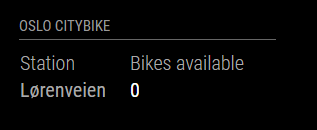

# MagicMirror² Module: OsloCityBike
'MMM-OsloCityBike' is a module for displaying CityBike availability for the Oslo and Akershus region in Norway on a [MagicMirror²](https://magicmirror.builders/). It's using data from [Ruter.no](http://reisapi.ruter.no/help).

This module has largely been based on the [MMM-Ruter](https://github.com/CatoAntonsen/MMM-Ruter) module from CatoAntonsen.



Current version is 1.0.0 See [changelog](CHANGELOG.md "Version history") for version history.

## Installation

Remote to your MM2-box with your terminal software and go to your MagicMirror's Module folder:
````bash
cd ~/MagicMirror/modules
````

Clone the repository:
````bash
git clone https://github.com/TobbenTM/MMM-OsloCityBike.git
````

Go to the modules folder:
````bash
cd MMM-OsloCityBike
````

Install the dependencies:
````bash
npm install
````

Add the module to the modules array in the `config/config.js` file by adding the following section. You can change this configuration later when you see this works:
```
{
	module: 'MMM-OsloCityBike',
	header: 'Oslo CityBike',
	position: 'top_left',
	config: {
		lat: {
			min: 59.930912,
			max: 59.930912
		},
		long: {
			min: 10.791843,
			max: 10.791843
		}
	}
},
```

# Configuration options

These are the valid configuration options you can put inside the config array above:

Configuration option | Comment | Default 
---|---|---
lat/long, min/max | Use to define a geographical search area, or the precise location of one station | n/a
serviceReloadInterval | Refresh rate in MS for how often we call Ruter's web service. NB! Don't set it too low! | 30000 
timeReloadInterval | Refresh rate how often we check if we need to update the time in the GUI | 1000 
animationSpeed | How fast the animation changes when updating mirror - in milliseconds | 0  
fade | Set this to true to fade list from light to dark | true  
fadePoint | Start fading on 1/4th of the list | 0.25

## Translations

This modules is translated to the following languages:

Language | Responsible
---|---
nb (Norwegian) | Me
en (English) | Me

If you add other languages, please make a PR or drop me a line!
